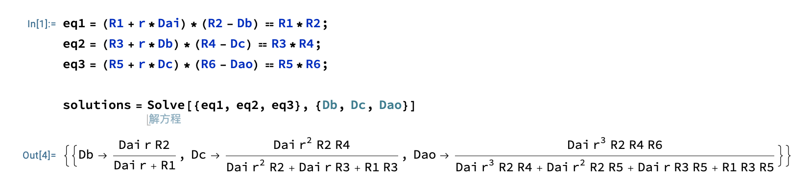
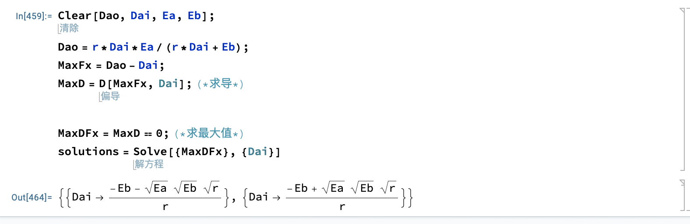

- # Mathematica  
https://www.wolfram.com/?source=nav  

- [Wolfram 语言](#wolfram-语言)
  - [简介](#简介)
  - [算法验证](#算法验证)
  - [Mathematica验证](#mathematica验证)


## Wolfram 语言  
### 简介
运行: 
```sh
In[2]:= Range[10]
Out[2]= {1, 2, 3, 4, 5, 6, 7, 8, 9, 10}
```

> shift+enter执行

符号表示:  
`numbers` `strings` `images` `arrays` `graphs` `formulas` `documents` `interfaces` `code` ...  

列表: 
```sh
{3, 4, 5, 7/8, x, y, x^2 + 3 y^3, {a, b, c}, \!\(\*
Graphics3DBox[SphereBox[{0, 0, 0}],
ImageSize->{46.62109375, Automatic},
ViewPoint->{1.3423934952878664`, -2.404165276254038, 
     1.9667152890703756`},
ViewVertical->{0.009348068236588528, -0.008691644947737727, 
     0.9999185311455862}]\)}
```

输出结果:  
```sh
{3, 4, 5, 7/8, x, y, x^2 + 3 y^3, {a, b, c}, \!\(\*
Graphics3DBox[SphereBox[{0, 0, 0}],
ImageSize->{46.62109375, Automatic},
ViewPoint->{1.3423934952878664`, -2.404165276254038, 
     1.9667152890703756`},
ViewVertical->{0.009348068236588528, -0.008691644947737727, 
     0.9999185311455862}]\)}
```

迭代器:  
```sh
In[4]:= Table[x^2, {x, 10}]
Out[4]= {1, 4, 9, 16, 25, 36, 49, 64, 81, 100}
```

赋值:  
```sh
t := Now
DateObject[{2023, 5, 7, 23, 59, 9.005213}, "Instant", "Gregorian", 8.]

Module[{a = 1}, a + 8]
9
```

模式: 
```sh
Replace[f[100], f[x_] -> x + 5]
输出: 105 
```

函数定义:
```sh
f[x_, y_] := x + y
f[2, 3]
输出: 5
```

纯函数:
```sh
# 第一个参数 #
(# + 1) &

(# + 1) &[50]
输出: 51
```


图形: 
```sh
ListLinePlot[{5, 6, 1, 5, 7, 8, 1, 3}]
```

交互式界面:
```sh
Manipulate[Plot[Sin[a x], {x, 0, 10}], {a, 1, 5}]
```

### matlab算法验证  
https://github.com/ymm135/token-arbitrage/blob/master/md/uniswap-v2.md  

模拟的运算:  A->B->C->A, 正好三个池子的数据  

matlab操作
```sh
syms Dai Db Dc Dao R1 R2 R3 R4 R5 R6 r
eq1 = (R1+r*Dai)*(R2-Db)==R1*R2
eq2 = (R3+r*Db)*(R4-Dc)==R3*R4 
eq3 = (R5+r*Dc)*(R6-Dao)==R5*R6
solve(eq1,eq2,eq3,Db,Dc,Dao)
ans = 

  包含以下字段的 struct:

     Db: (Dai*R2*r)/(R1 + Dai*r)
     Dc: (Dai*R2*R4*r^2)/(Dai*R2*r^2 + Dai*R3*r + R1*R3)
    Dao: (Dai*R2*R4*R6*r^3)/(Dai*R2*R4*r^3 + Dai*R2*R5*r^2 + Dai*R3*R5*r + R1*R3*R5)
```
> E1/E2 分别为A->B池子的A币的数量和B币的总量，后面依次类推  

对应的表达式:  
$$\left(R_{1}+r\mathrm{Dai}\right)\left(R_{2}-\mathrm{Db}\right)=R_{1}R_{2}$$
$$\left(R_{3}+r\mathrm{Db}\right)\left(R_{4}-\mathrm{Dc}\right)=R_{3}R_{4}$$
$$\left(R_{5}+r\mathrm{Dc}\right)\left(R_{6}-\mathrm{Dao}\right)=R_{5}R_{6}$$


多项式求解:
$$Db=\frac{\mathrm{Dai}R_{2}r}{R_{1}+\mathrm{Dai}r}$$
$$Dc=\frac{\mathrm{Dai}R_{2}R_{4}r^2}{\mathrm{Dai}R_{2}r^2+\mathrm{Dai}R_{3}r+R_{1}R_{3}}$$
$$Dao=\frac{\mathrm{Dai}R_{2}R_{4}R_{6}r^3}{\mathrm{Dai}R_{2}R_{4}r^3+\mathrm{Dai}R_{2}R_{5}r^2+\mathrm{Dai}R_{3}R_{5}r+R_{1}R_{3}R_{5}}$$   

> Dai 输入A币的数量, Dao输出A币的数量 

提取出$E_{a}$,$E_{b}$参数
$$E_{a}=\frac{r^2R_{2}R_{4}R_{6}}{r^2R_{2}R_{4}+rR_{2}R_{5}+R_{3}R_{5}}$$
$$E_{b}=\frac{R_{1}R_{3}R_{5}}{r^2R_{2}R_{4}+rR_{2}R_{5}+R_{3}R_{5}}$$
整理表达式得:  

$$Dao=\frac{rDaiE_{a}}{rDai+E_{b}}$$  

通过matlab验证是否相等:
```sh
Dao=(Dai*R2*R4*R6*r^3)/(Dai*R2*R4*r^3 + Dai*R2*R5*r^2 + Dai*R3*R5*r + R1*R3*R5)

Ea=r^2*R2*R4*R6/(r^2*R2*R4+r*R2*R5+R3*R5)
Eb=R1*R3*R5/(r^2*R2*R4+r*R2*R5+R3*R5)
Daos=r*Dai*Ea/(r*Dai+Eb)  

# 需要变换，不然不能相等，相等的前提是分式都一样才行  
simplify(Daos)

# 判断是否相等
isequal(Dao,simplify(Daos))
ans =

  logical

   1
``` 

证明表达式简化是正确的，可以使用Ea与Eb表示.   

有套利空间的前提就是$max(Dao - Dai)>0$, 也就是输出大于输入币的数量。  

$$max=\frac{rDaiE_{a}}{rDai+E_{b}}-Dai$$  

如果想要盈利，那就是$max>0$, 也就是不等式成立  

$$\frac{rDaiE_{a}}{rDai+E_{b}}-Dai>0$$  

在$Dai>0$，并且$0\le r\le 1$、$E_a>0$、$E_b>0$的条件下:
通过matlab求解得出:  

$$E_{b}+rDai<rE_{a}$$

由于$Dai>0$,$r>0$可以消除，最后化简为:  

$$E_{b}<rE_{a}$$ 

```sh
syms Dai Dao Ea Eb r

Dao = r*Dai*Ea/(r*Dai+Eb);

% 限定条件
% Dai大于0
assume(Dai>0)

% r小于1，大于0
assume(0<r<=1)
assume(Ea>0)
assume(Eb>0)

max = Dao - Dai > 0;
disp("max函数为:")

% 0 < (Dai*Ea*r)/(Eb + Dai*r) - Dai
disp(max)

% 简化后为: Eb + Dai*r < Ea*r
max = simplify(max)
```
----

算出有套利空间后，需要计算最优解  
$$max=\frac{rDaiE_{a}}{rDai+E_{b}}-Dai$$  

首先对`max`函数求导  
```sh
>> syms r Dai Ea Eb
>> max = (Dai*Ea*r)/(Eb + Dai*r) - Dai
>> diffMax = diff(max,Dai)
 
ans =
 
(Ea*r)/(Eb + Dai*r) - (Dai*Ea*r^2)/(Eb + Dai*r)^2 - 1

# 求最优解
solve(diffMax == 0, Dai)
ans =
 
-(Eb + (Ea*Eb*r)^(1/2))/r
-(Eb - (Ea*Eb*r)^(1/2))/r
```

因为是个一元二次方程，所以有两个解，结果为:
$$-\frac{\mathrm{Eb}+\sqrt{\mathrm{Ea}\mathrm{Eb}r}}{r}$$
$$\frac{\sqrt{\mathrm{Ea}\mathrm{Eb}r}-\mathrm{Eb}}{r}$$

最优解为:  
$$Dai=\frac{\sqrt{\mathrm{Ea}\mathrm{Eb}r}-\mathrm{Eb}}{r}$$  

----

### Mathematica验证  

```sh
eq1 = (R1 + r*Dai)*(R2 - Db) == R1*R2;
eq2 = (R3 + r*Db)*(R4 - Dc) == R3*R4;
eq3 = (R5 + r*Dc)*(R6 - Dao) == R5*R6;

solutions = Solve[{eq1, eq2, eq3}, {Db, Dc, Dao}]
```
输出
```sh
{{Db -> (Dai r R2)/(Dai r + R1), 
  Dc -> (Dai r^2 R2 R4)/(Dai r^2 R2 + Dai r R3 + R1 R3), 
  Dao -> (Dai r^3 R2 R4 R6)/(Dai r^3 R2 R4 + Dai r^2 R2 R5 + Dai r R3 R5 + R1 R3 R5)
```

<br>
<div align=center>
  </img>
</div>


化简方程:  
```sh
Ea = r^2*R2*R4*R6/(r^2*R2*R4 + r*R2*R5 + R3*R5);
Eb = R1*R3*R5/(r^2*R2*R4 + r*R2*R5 + R3*R5);
Daos = r*Dai*Ea/(r*Dai + Eb);

simplifiedDaos = Simplify[Daos]

# 输出
(Dai r^3 R2 R4 R6)/(R1 R3 R5 + Dai r (r^2 R2 R4 + r R2 R5 + R3 R5))
```

判断两个变量是否相等:
```sh
Dao = (Dai*r^3*R2*R4*R6)/(Dai*r^3*R2*R4 + Dai*r^2*R2*R5 + Dai*r*R3*R5 + R1*R3*R5);
Daos = (Dai*r^3*R2*R4*R6)/(R1*R3*R5 + Dai*r*(r^2*R2*R4 + r*R2*R5 + R3*R5));

expandedDao = Expand[Dao];
expandedDaos = Expand[Daos];

simplifiedDao = Simplify[expandedDao]
simplifiedDaos = Simplify[expandedDaos]

Print[simplifiedDao == simplifiedDaos]
```

输出结果为:`True`  
> 之前是因为两个变量的形式不一样，所以无法比较  


求取条件值:  
```sh
Clear[Dao, Dai, Ea, Eb]
Dao = r*Dai*Ea/(r*Dai + Eb);
MaxEq = Dao - Dai > 0;

# 转换为输出
MaxEq = -Dai + (Dai*Ea*r)/(Eb + Dai*r) > 0;
solutions = Solve[ {MaxEq, r > 0, Ea > 0, Eb > 0, Dai > 0}, {Ea, Eb}];
Print[solutions]
```

条件: $Dai>0, r>0, Ea>0, Eb>0$  

$$\frac{\text{Dai} \text{Ea} r}{\text{Dai} r+\text{Eb}}-\text{Dai}>0$$


要确定满足不等式 -Dai + (Dai*Ea*r)/(Eb + Dai*r) > 0 时，变量 Ea 和 Eb 必须满足的关系，我们可以进行如下的推导：

首先，我们将不等式移项得到：

(Dai*Ea*r)/(Eb + Dai*r) > Dai

然后，我们可以通过交叉乘法消除分数：

Dai*Ea*r > Dai*(Eb + Dai*r)

展开右侧的乘法项：

Dai*Ea*r > Dai*Eb + Dai^2*r

接下来，我们将 Dai*Ea*r 和 Dai*Eb 分别移到左右两侧：

Dai*Ea*r - Dai*Eb > Dai^2*r

可以将左侧的项进行因式分解：

Dai*r*(Ea - Eb) > Dai^2*r

然后，我们可以将 Dai*r 除掉：

Ea - Eb > Dai

因此，满足不等式 -Dai + (Dai*Ea*r)/(Eb + Dai*r) > 0 时，变量 Ea 和 Eb 必须满足关系 Ea - Eb > Dai。

这个关系说明了 Ea 必须大于 Eb，并且它们的差值必须大于 Dai。

请注意，这是满足不等式的必要条件，但不一定是充分条件。仍然需要进一步的分析来确定充分条件。

> 当命题“若P则Q”与“若Q则P”皆为真时，P是Q的充分必要条件，同时，Q也是P的充分必要条件。  
> 当命题“若P则Q”为真，而“若Q则P”为假时，我们称P是Q的充分不必要条件，Q是P的必要不充分条件，反之亦然。  

求导
```sh
Clear[Dao, Dai, Ea, Eb];
Dao = r*Dai*Ea/(r*Dai + Eb);
MaxFx = Dao - Dai;
MaxD = D[MaxFx, Dai]; (* 求导 *)

MaxDFx = MaxD == 0; (* 求最大值 *)
solutions = Solve[ {MaxDFx}, {Dai} ]

# 输出
{{Dai -> (-Eb - Sqrt[Ea]*Sqrt[Eb]*Sqrt[r])/r}, 
   {Dai -> (-Eb + Sqrt[Ea]*Sqrt[Eb]*Sqrt[r])/r}}
```

<br>
<div align=center>
  </img>
</div>

