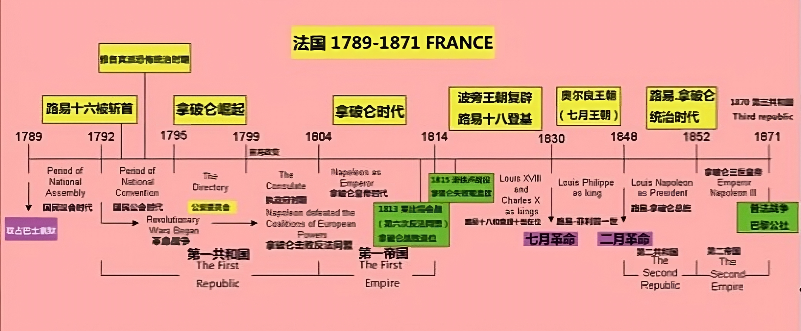

- # 时间线

## 中国
### 中国历史坐标尺

 

  </img>

> 可以下载原图，放大观看

### 中国近现代史坐标轴

 

  </img>

## 世界

 

  </img>

### 法国  
https://www.youtube.com/watch?v=cmCBFFyycns  

 

  </img>

#### 雨果  
`維克多·馬里·雨果`（法語：Victor Marie Hugo，法語：[viktɔʁ maʁi yɡo] （關於這個音頻文件 聆聽），1802年2月26日—1885年5月22日），法國浪漫主義文學的代表人物和19世紀前期積極浪漫主義文學運動的領袖，法國文學史上卓越的作家。雨果幾乎經歷了19世紀法國的所有重大事變。一生創作了眾多詩歌、小說、劇本、各種散文和文藝評論及政論文章。代表作有《鐘樓怪人》、《九三年》、和《悲慘世界》等。在法國，雨果主要以詩集紀念，如《靜觀集》和《歷代傳說》。他創作了4000多幅畫，積極參與許多社會運動，如廢除死刑。  

