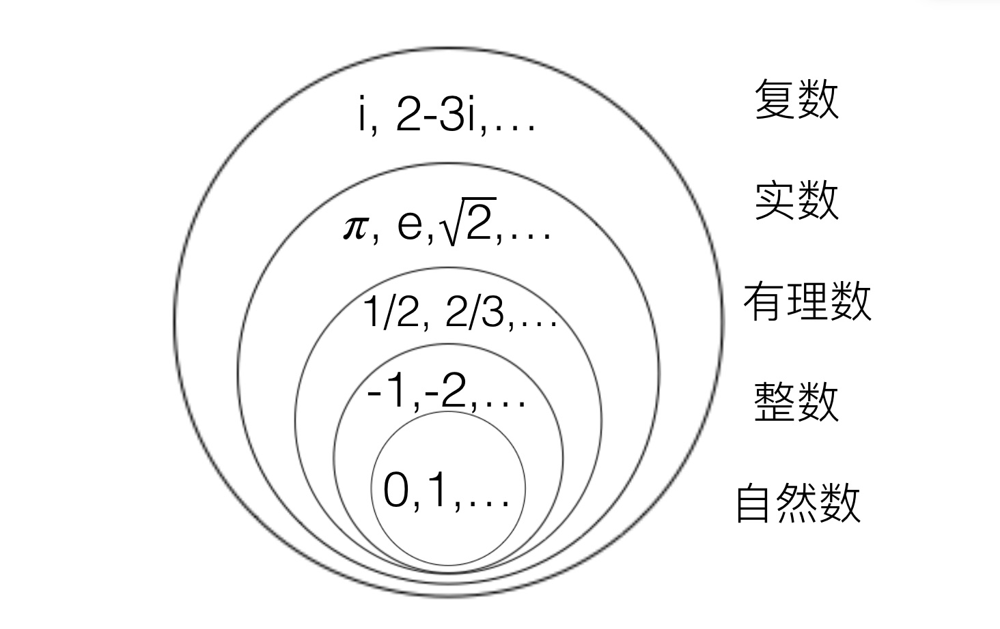
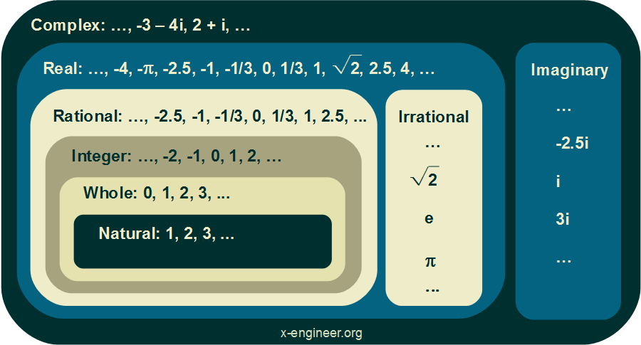

- # 吴军-数学通识

## 数学的线索  
> 以毕达哥拉斯为线索，告诉你数学从猜想到定理再到应用的全过程。  

### 概念  

 

  </img>

 

  </img>

> natural, integers, rational(有理数), real, complex  

#### Natural Numbers  
The first type of numbers are the natural numbers. They are also called the counting numbers because we use natural numbers when we count objects.

The natural numbers are all positive numbers, starting with one and going towards infinity: 1, 2, 3, 4, …  

The mathematical symbol of the natural numbers is the capital letter N with double diagonal lines and an asterisk symbol:

$$\mathrm {N^*} $$

#### Whole Numbers  
The whole numbers contain all natural (counting) numbers plus 0 (zero): 0, 1, 2, 3, …  

The mathematical symbol for whole numbers is the capital letter N with double diagonal lines:

$$\mathrm {N} $$

#### Integer Numbers  
If we need to represent `negative` values, the whole numbers are not enough since they are only `positive`. Integer numbers contain all the whole numbers in both positive and negative form: …, -3, -2, -1, 0, 1, 2, 3, …  

The mathematical symbol for integer numbers is the capital letter Z with double diagonal lines:

$$\mathrm {Z} $$

#### Rational Numbers  
Rational numbers are the numbers that can be represented as a `fraction` of two integer numbers.  

> `/frækʃn/` 分数，小数；小部分  

$$
\frac{y}{x}
$$

with the following properties:  

$$
x\in Z, y\in Z, y\ne 0
$$

The mathematical symbol for rational numbers is the capital letter Q with double vertical lines:

$$\mathrm {Q} $$

#### Irrational Numbers  
As the names suggests Irrational Numbers are numbers that are not rational, they can not be expressed as a ratio between two integers.  

> `/ɪˈræʃən(ə)l/`   

Another example of irrational numbers is the result of the square root function:  

$$\sqrt{x} ,x\in N$$

If x is an natural number the square root of it will be a irrational number:  

$$\sqrt{2} = 1.4142135623730951454746…$$

The mathematical symbol for irrational numbers is the capital letter I with double vertical lines:  

$$\mathrm {I} $$

#### Real Numbers  

If we combine both the rational and the irrational numbers in a group of numbers we’ll get the real numbers. So the real numbers contains both real and irrational numbers.  

The mathematical symbol for real numbers is the capital letter R with double vertical lines:  

$$\mathrm {R} $$  

#### Complex Numbers  

Things are getting a bit more complicated with complex numbers.  

If we want to know what is the square root of a negative number, we need to use complex numbers. In this case real numbers can not be used to describe the result.  

Complex numbers are a special case of numbers which have the following properties:  

- a complex number z has the general form of:  

$$z=a+bi$$  

- z has a real part (a) and an imaginary part (b)
- a and b are real numbers

The mathematical symbol for real numbers is the capital letter C with double vertical lines:  

$$\mathrm {C} $$  

